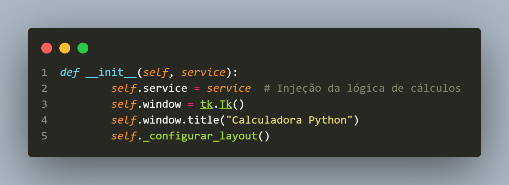
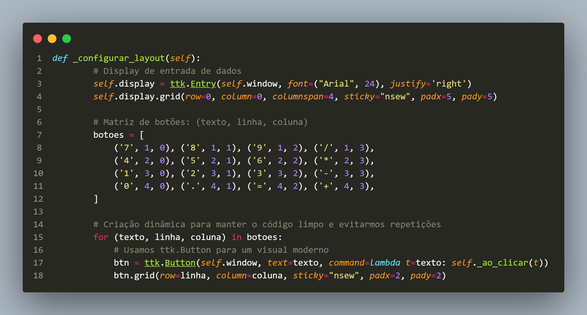
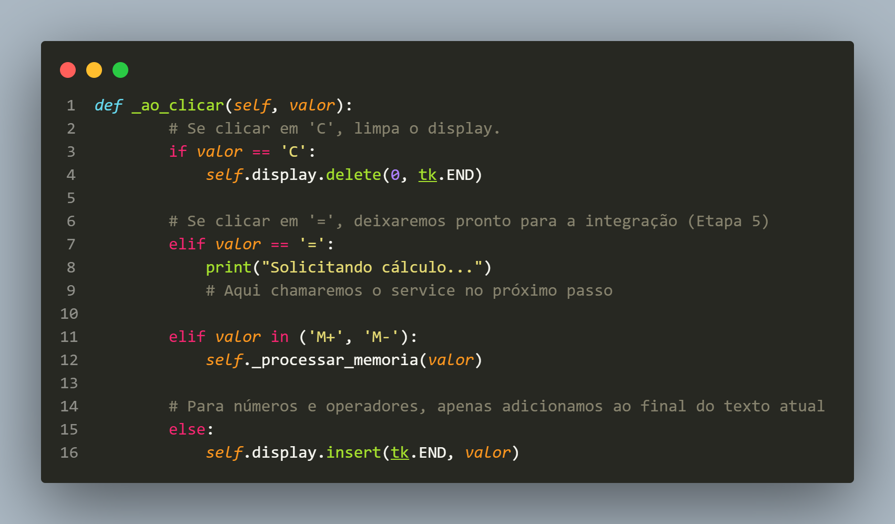
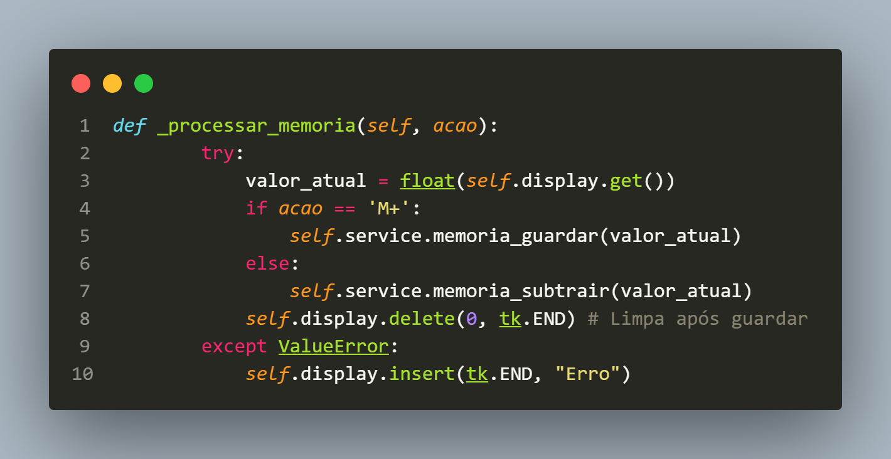
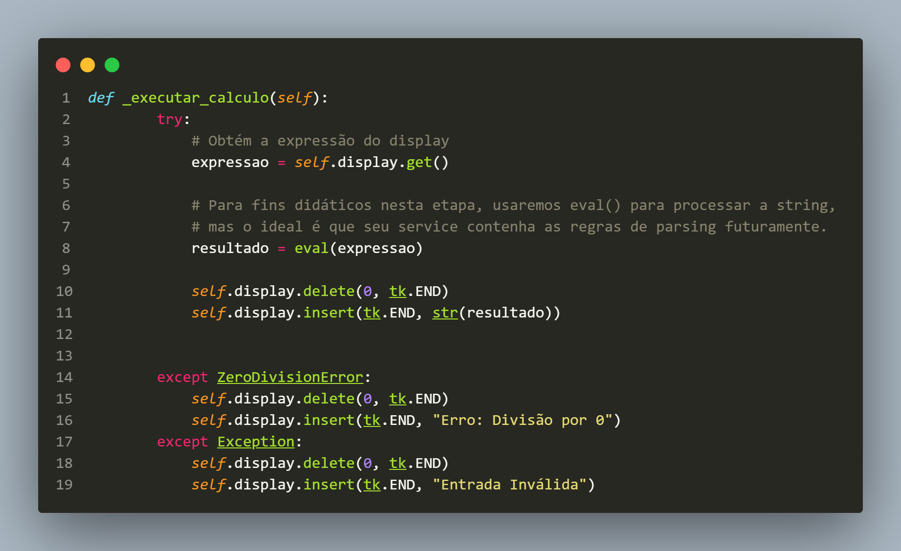
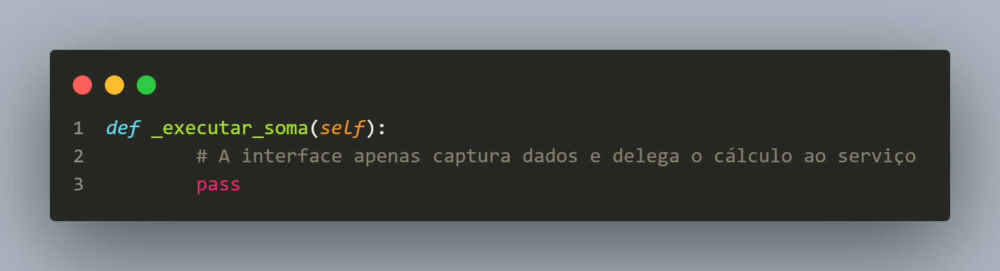
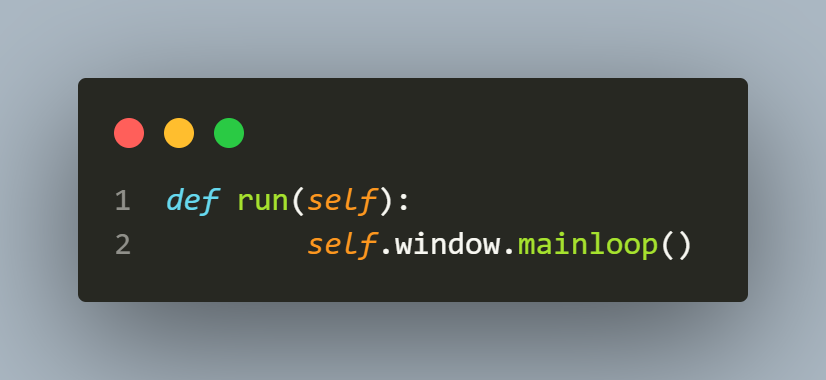

# Documentação calculadora_gui

## Importações

1. *import tkinter as tk*

```
Importa a biblioteca Tkinter, que é responsável por criar janelas, botões, caixas de texto, menus etc. Foi dado o apelido tk em vez de escrever tkinter.Tk(), você escreve tk.Tk().
``` 

2. *from tkinter import ttk*

```
Aqui é importado o módulo ttk. O ttk possui componentes mais modernos do Tkinter.

Exemplo:

- ttk.Button()
- ttk.Entry()
- ttk.Label()

Eles possuem um visual melhor que os componentes tradicionais.
```


## *Classe CalculadoraGUI*

Essa classe será responsável apenas pela interface gráfica.

Ela apenas:

- cria janela
- cria botões
- cria display
- envia informações para outra classe


## ***def `__init__`(self, service):***



Esse é o construtor da classe. Sempre que alguém fizer `gui = CalculadoraGUI(service)` o Python executará automaticamente o método `__init__`.

### + ***O parâmetro service:***
Perceba: `(service)`, Esse objeto representa a classe responsável pelos cálculos.

Por exemplo:

```
class CalculadoraService:

    def somar(self, a, b):
        return a + b

```

Depois:

```

service = CalculadoraService()

gui = CalculadoraGUI(service)

```

A interface recebe essa classe pronta. Isso é chamado de **Injeção de Dependência (Dependency Injection)**

### + ***self.service = service***

Guarda o objeto recebido dentro da própria classe.

Agora qualquer método poderá acessar self.service

Por exemplo:

```
self.service.somar(10,20)
```

Observe o comentário *Injeção da lógica de cálculos*, ou seja, a interface não calcula, ela apenas chama `service.somar()`

### + ***self.window = tk.Tk()***

Cria a janela principal, é equivalente a "Abra uma janela.", depois dessa linha já existe uma janela na memória.

### + ***self.window.title("Calculadora Python")***

Define o título da janela. Na barra superior aparecerá: - "Calculadora Python"

### + ***self._configurar_layout()***

Assim que a janela é criada, esse método monta toda a interface.

Ele criará:

- display
- botões
- organização

## ***def _configurar_layout(self):***



Método privado (pela convenção do _). Responsável por desenhar toda a interface.

### + ***self.display = ttk.Entry(...)***

Cria uma caixa de texto. Ela será o visor da calculadora.

Exemplo:

```
____________________

45+8

____________________
```

Dentro dela aparecem vários parâmetros.

1. `self.window`
     Diz que esse componente pertence à janela.

2. `font=("Arial",24)`
    Fonte usada.

3. `justify='right'`
    Todo texto digitado ficará alinhado à direita.


### + ***self.display.grid(...)***

Agora o display é colocado na janela. Antes ele existia. Agora ele ganha uma posição.

1. `row`
    row=0 - Linha zero. Primeira linha.

2. `columnspan`
    columnspan=4 - O display ocupa quatro colunas.
    Ex.
    ```
    ---------
    |       |
    ---------
    |7|8|9|+|
    |4|5|6|-|
    ```

3. `sticky`
    sticky="nsew", Significa:

    North
    South
    East
    West

Ou seja:

O componente se estica para todos os lados da célula.

4. `padx` 
    Espaçamento horizontal.

5. `pady`
    Espaçamento vertical.


### +  ***botoes / for***

O objetivo desse código é criar todos os botões da calculadora automaticamente, sem precisar escrever um bloco de código para cada botão.

- ***botoes = []*** 
    Aqui você cria uma variável chamada: botoes. Ela armazenará todas as informações necessárias para construir os botões. Mas observe que ela é uma lista, uma lista guarda vários elementos. Nesse caso ela guarda tuplas, cada item é uma tupla, o primeiro é ('7', 1, 0), Isso significa: texto = "7", linha = 1, coluna = 0, Cada posição possui um significado (Texto	 Linha	Coluna). Toda essa variável é uma matriz

```
Aqui foi aplicado um princípio chamado DRY (Don't Repeat Yourself).

Ou seja:

Não repita código desnecessariamente.
```

- ***O laço for*** 
O Python faz o desempacotamento (unpacking). Quando escreve: (texto, linha, coluna) o Python pega automaticamente cada posição da tupla. Por exemplo: ('5',2,1), vira texto = "5", linha = 2, coluna = 1. Isso é chamado de desempacotamento de tuplas (tuple unpacking).

- ***Dentro do for*** 
Agora cada repetição cria um botão. btn = ttk.Button( Toda vez que o laço roda ele cria um botão novo. 
```
Na primeira volta:

Botão 7

Na segunda:

Botão 8

Na terceira:

Botão 9
```

Até terminar todos.

- **self.window**

O botão pertence à janela principal.


- **text=texto**

Aqui acontece algo interessante.

```
Na primeira volta:

texto = "7"

Então vira:

text="7"

Na segunda:

texto = "8"

Vira

text="8"
```

Ou seja, o texto muda automaticamente.

- **command=lambda t=texto: self._ao_clicar(t)**

O parâmetro command define qual função será executada quando o botão for clicado. Se você escrevesse:

command=self._ao_clicar

a função seria chamada, mas ela não receberia nenhuma informação sobre qual botão foi pressionado.

Você precisa passar o valor do botão ("7", "+", "=" etc.).

```
O que é uma função lambda?

Uma lambda é uma função anônima (sem nome).

Por exemplo:

lambda x: x * 2

é equivalente a:

def dobrar(x):
    return x * 2

No seu código:

lambda t=texto: self._ao_clicar(t)

é praticamente igual a:

def clicar():
    self._ao_clicar(texto)

Mas como você precisa criar uma função diferente para cada botão, a lambda torna isso muito mais prático.
```

- **Por que usar t=texto?**

Esse detalhe evita um problema comum chamado late binding. Se você escrevesse apenas:

`command=lambda: self._ao_clicar(texto)`

todos os botões acabariam usando o último valor da variável texto após o término do laço. Como o último elemento da lista é:

`('+', 4, 3)`

todos os botões chamariam:

`self._ao_clicar("+")`

Ao escrever:

`lambda t=texto: self._ao_clicar(t)`

você "congela" o valor atual de texto no momento em que a lambda é criada.

Então:

```
Botão 7 chama _ao_clicar("7")
Botão 8 chama _ao_clicar("8")
Botão / chama _ao_clicar("/")
Botão = chama _ao_clicar("=")
``` 

Cada botão passa a informação correta.

- **Depois vem o grid btn.grid(**

Agora o botão é colocado na janela.

## ***def_ aoclicar(self, valor):***

)

Ela funciona como um ponto central de entrada para todos os cliques dos botões.

#### **obs** 
```
 O _ no início é uma convenção do Python que indica que esse método é de uso interno da classe. Ele pode ser chamado de fora, mas a intenção é que apenas a própria classe o utilize.
 ```

```
self - Como esse método pertence à classe CalculadoraGUI, ele precisa receber uma referência para o próprio objeto. Quando você cria a interface:

gui = CalculadoraGUI(service)

e algum botão chama:

self._ao_clicar("7")

o Python faz internamente algo semelhante a:

CalculadoraGUI._ao_clicar(gui, "7")

Ou seja:

self  -> gui

valor -> "7"
```

```
valor - Esse parâmetro recebe exatamente o texto do botão que foi pressionado. Graças a lambda, cada botão envia seu próprio texto.
```

### Primeiro bloco
 - `if valor == 'C'` : Aqui começa uma estrutura de decisão. O Python pergunta:

"O botão clicado foi o C?"

```
O operador == significa comparação. Ele verifica se os dois valores são iguais.
```

Exemplo: "7" == "7" - Resultado: True

### self.display.delete(0, tk.END)

Essa linha limpa completamente o display.

- self.display é o componente Entry criado anteriormente.

```
self.display = ttk.Entry(...). Ele representa a caixa de texto da calculadora.
```

Imagine que ela contém: 123+45, o método `delete()` remove caracteres do Entry. Sua sintaxe é: `delete(início, fim)`

- o parâmetro `0`, significa: comece a apagar o primeiro caractere

- o parâmetro `ttk.END` ela significa: Vá até o final do texto. O END é uma constante do tkinter.

Então `self.display.delete(0, tk.END)` significa: "Apague tudo do primeiro caractere até o último."


### elif valor == '=':

O Python só chega aqui se a primeira condição (valor == 'C') for falsa.

Agora ele pergunta: " O botão foi "=" ? " Se sim... `print("Solicitando cálculo...")` No console aparecerá: Solicitando cálculo...

**Essa é uma implementação temporária.**
será aqui que a interface chamará a classe responsável pelos cálculos.


### elif valor in ('M+', 'M-'):

Assim, o fluxo fica: 

```
Usuário clica em M+
        ↓
_ao_clicar('M+')
        ↓
elif valor in ('M+', 'M-')
        ↓
_processar_memoria('M+')
        ↓
verifica se é M+
        ↓
adiciona valor à memória
```

```
Usuário clica em M-
        ↓
_ao_clicar('M-')
        ↓
elif valor in ('M+', 'M-')
        ↓
_processar_memoria('M-')
        ↓
verifica se é M-
        ↓
subtrai valor da memória
```

**Significa dizer** : "Se o botão clicado for M+ ou M-, faça o processamento de memória."

### else:

Esse else significa: "Se não era C e também não era =, então execute este bloco." Ou seja, ele trata todos os outros botões.

### self.display.insert(tk.END, valor)

Essa linha adiciona texto ao display.

- O método insert() insere caracteres em um Entry.

Sua sintaxe é: `insert(posição, texto)`

- `tk.END` : Insira no final do texto.

### Fluxo completo da função
Imagine que o usuário clique no botão 9.

O fluxo será:

```
Usuário clica "9"
        │
        ▼
_ao_clicar("9")
        │
        ▼
valor == "C" ?
        │
      False
        │
        ▼
valor == "=" ?
        │
      False
        │
        ▼
valor == "M+ / M-" ?
        │
      False
        │
        ▼
   Entra no else
        │
        ▼
display.insert(tk.END, "9")
        │
        ▼
  Display mostra:

9
```
```
Agora imagine que ele clique em C.

Usuário clica "C"
        │
        ▼
_ao_clicar("C")
        │
        ▼
valor == "C" ?
        │
      True
        │
        ▼
display.delete(0, tk.END)
        │
        ▼
Display vazio
```

```
Agora o botão =.

Usuário digita:

12+8
        │
        ▼
Clica "="
        │
        ▼
_ao_clicar("=")
        │
        ▼
valor == "C" ?
        │
      False
        │
        ▼
valor == "=" ?
        │
      True
        │
        ▼
print("Solicitando cálculo...")

```

```
                Usuário
                    │
                    ▼
            Clica em um botão
                    │
                    ▼
            _ao_clicar(valor)
                    │
         ┌──────────┼──────────┐
         ▼          ▼          ▼
      valor=C    valor==      Outros
         │          │          │
         ▼          ▼          ▼
 Limpa display   Solicita   Adiciona o
                 cálculo     caractere
                    │
                    ▼
      (próxima etapa: chamar o service)
```

## ***def _processar_memoria(self, acao):***



### valor_atual = float(self.display.get())

Um exemplo. Imagine que o display esteja assim:
```
┌─────────────┐
│    150      │
└─────────────┘
```
Então self.display.get() retorna "150". Observe que isso é uma string. Por isso usamos `float(...)` para transformar "150" em 150.0
Então `valor_atual = float(self.display.get())`
significa "Pegue o que está no display e transforme em um número decimal."

**O fluxo seria dessa forma**:
Por exemplo, se o display contém 150 e o usuário aperta M+, o fluxo será:
```
display
  ↓
"150"
  ↓
float()
  ↓
150.0
  ↓
memoria_guardar(150.0)
```

### except
Imagine que o display contenha abc. Quando o Python tentar fazer `float("abc")` ele não conseguirá converter para número. Isso gera um `ValueError` E coloca `Erro`

***Estado Persistente***: O CalculadoraService agora mantém um valor em self.memoria, simulando a persistência temporária de dados.

***Interação entre Camadas***: A interface captura o número, converte para float e delega a alteração do estado para o serviço.


## ***def _executar_calculo(self):***



Utilizado para capturar erros, como a divisão por zero.


```python
self.display.delete(0, tk.END)
            self.display.insert(tk.END, "Erro: Divisão por 0")
```
- A primeira linha do código deleta do primeiro ao ultomo elemento. 
- A segunda insere no final uma mensagem de erro exibindo o porque do erro.

**Em resumo**

1. ***Conexão lógica***: O botão = agora aciona a função _executar_calculo, cumprindo o objetivo de integração.

2. ***Tratamento de Erros***: Foi implementado a captura de exceções para evitar que a aplicação trave em operações inválidas.

3. ***Feedback Visual***: O display é limpo e atualizado com o resultado ou com uma mensagem de erro amigável.

## ***def _executar_soma(self):***



Método chamado quando o botão é pressionado.

# Fluxo esperado:

```

Usuário

↓

Interface

↓

CalculadoraService

↓

Resultado

↓

Interface

```

A GUI apenas:

- lê números
- chama o serviço
- mostra o resultado

Quem realmente calcula é outra classe.


### + ***pass***

Significa:

"Ainda não implementei esse método." É apenas um espaço reservado.

## ***def run(self):***



Cria um método chamado run(). Sua única responsabilidade é iniciar a interface.

### + ***self.window.mainloop()***

Essa é a linha mais importante do Tkinter. Ela inicia o loop de eventos da interface. Enquanto essa linha estiver executando, o programa fica "escutando" ações do usuário: 

- clique em botão
- digitação
- fechar janela
- redimensionar janela

Sem ela, a janela abriria e fecharia imediatamente.

# Resumo do fluxo do programa

```
Criar CalculadoraGUI
          │
          ▼
     __init__()
          │
          ├── Guarda o service
          │
          ├── Cria a janela
          │
          ├── Define o título
          │
          └── Chama _configurar_layout()
                       │
                       ▼
                 Cria display
                 Cria botão "+"
            Organiza tudo com grid()
                       │
                       ▼
                     run()
                       │
                       ▼
               window.mainloop()
                       │
                       ▼
       Usuário interage com a calculadora
                       │
                       ▼
                Clique no botão "+"
                       │
                       ▼
               _executar_soma()
                       │
                       ▼
          Chama `self.service.somar(...)`
                       │
                       ▼
           Exibe o resultado no display
```

# Por que essa abordagem?

1. **Separação de Responsabilidades**: A classe CalculadoraGUI cuida apenas de desenhar e capturar cliques, enquanto o CalculadoraService resolve a matemática. 

2. **Modularização**: Se você decidir trocar o Tkinter por outra biblioteca no futuro, a lógica matemática no arquivo de serviço não precisará de nenhuma alteração.